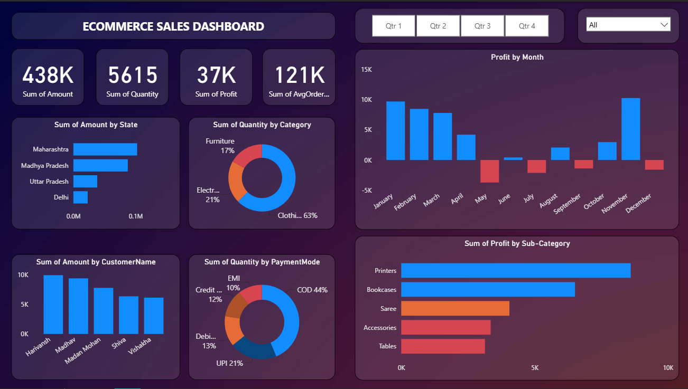

# E-commerce Sales Dashboard | Power BI

An interactive Power BI dashboard designed to analyze e-commerce sales performance across different business dimensions such as sales, profit, customers, products, states, and payment methods. This dashboard helps business stakeholders monitor KPIs, identify sales trends, and make data-driven decisions.

---

## Dashboard Preview



---

## Business Problem

E-commerce businesses generate large amounts of sales data every day. Without proper visualization, it becomes difficult to identify:

- Which states generate the highest revenue?
- Which product categories perform the best?
- Who are the top customers?
- Which payment methods are most preferred?
- How does profit change throughout the year?

This dashboard provides a centralized view of these business metrics to support better decision-making.

---

## Objectives

- Monitor overall business performance.
- Track sales and profit across different states.
- Analyze category-wise sales distribution.
- Identify top-performing customers.
- Compare payment method usage.
- Visualize monthly profit trends.
- Enable interactive filtering using slicers.

---

## Dataset

The project uses two datasets:

- **Orders** – Order details including sales amount, category, customer, state, and order information.
- **Details** – Additional transaction details such as quantity, payment mode, and profit.

---

## Tools & Technologies

- Power BI Desktop
- Power Query
- DAX (Data Analysis Expressions)
- Data Modeling

---

## Dashboard Features

### KPI Cards

- Total Sales
- Total Quantity Sold
- Total Profit
- Average Order Value

### Interactive Filters

- Quarter Selection
- Category Filter

### Visualizations

- Sales by State
- Quantity by Category
- Monthly Profit Analysis
- Top Customers by Sales
- Quantity by Payment Mode
- Profit by Sub-Category

---

## Key Insights

- Maharashtra generated the highest sales.
- Clothing contributed the largest share of total quantity sold.
- Cash on Delivery (COD) is the most preferred payment method.
- November recorded the highest monthly profit.
- Printers generated the highest profit among all sub-categories.

---

## Skills Demonstrated

- Data Cleaning using Power Query
- Data Modeling
- DAX Measure Creation
- Interactive Dashboard Design
- Business KPI Development
- Data Visualization Best Practices
- Business Storytelling

---

## Repository Structure

```
Ecommerce-Sales-Dashboard/
│
├── Ecommerce_Sales_Dashboard.pbix
├── README.md
│
├── dataset/
│   ├── Orders.csv
│   └── Details.csv
│
└── images/
    └── Dashboard.png
```
